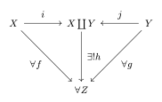

集合の直和について解説します。

<!--more-->

## 前提知識

- [集合]()
- [和集合]()
- [直積集合]()

## 定義

{}

$X, Y$を集合とする。$x \in X, y \in Y$に対し、$(0, x), (1, y)$を含む集合を$X$と$Y$の**直和集合**といい、$X \coprod Y$とかく。つまり、
$$X \coprod Y := \{0\} \times X \cup \{1\} \times Y$$

より一般に、集合族$\set{X_\lambda}_{\lambda \in \Lambda}$に対し、その元の元$x_\lambda \in X_\lambda$を添字づけて区別した元の集合を$\set{X_\lambda}_{\lambda \in \Lambda}$の直和集合といい、$\coprod_{\lambda \in \Lambda} X_\lambda$とかく。つまり、
$$\coprod_{\lambda \in \Lambda} X_\lambda := \bigcup_{\lambda \in \Lambda} \set{(\lambda, x_\lambda); x_\lambda \in X_\lambda}$$

{}

## 注意

- 濃度について、$|X \coprod Y| = |X|+|Y|$が成り立つ。
- 上では2つの集合を0, 1で添字づけして区別したが、区別ができればよく、添字は必ずしも0, 1でなければいけない訳ではない。
- $i: X \to X \coprod Y, x \mapsto (0, x), j: Y \to X \coprod Y, y \mapsto (1, y)$とする。任意の集合$Z$、写像$f: X \to Z, g: Y \to Z$に対し、$h \circ i = f, h \circ j = g$を満たす写像$h$がただ一つ存在する。この性質を直和の普遍性と呼ぶ。図式にすると以下の通り。  
  

## 参考文献
