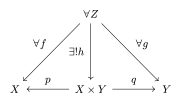

集合の直積について解説します。

<!--more-->

## 前提知識

- [集合]()

## 定義

{}

$X, Y$を集合とする。$x \in X, y \in Y$からなる順序対$(x, y)$の集合を$X$と$Y$の**直積集合**といい、$X \times Y$とかく。つまり、
$$X \times Y := \set{ (x, y); x \in X, y \in Y }$$

より一般に、集合族$\set{X_\lambda}_{\lambda \in \Lambda}$に対し、その順序対$(x_\lambda)_{\lambda \in \Lambda} \; (ただし、各x_\lambda \in X_\lambda)$の集合を$\set{X_\lambda}_{\lambda \in \Lambda}$の直積集合といい、$\prod_{\lambda \in \Lambda} X_\lambda$とかく。つまり、
$$\prod_{\lambda \in \Lambda} X_\lambda := \set{(x_\lambda)_{\lambda \in \Lambda}; \forall \lambda \in \Lambda, x_\lambda \in X_\lambda}$$

{}

## 注意

- 濃度について、$|X \times Y| = |X||Y|$が成り立つ。
- 直積集合の各元からある成分を取り出す写像を射影と呼ぶ。
  - 例えば、$X \times Y$において、$p(x, y) = x, q(x, y) = y$によって定めた$p: X \times Y \to X, q :X \times Y \to Y$が射影である。
- $p: X \times Y \to X, q: X \times Y \to Y$を射影とする。任意の集合$Z$、写像$f: Z \to X, g: Z \to Y$に対し、$p \circ h = f, q \circ h = g$を満たす写像$h$がただ一つ存在する。この性質を直積の普遍性と呼ぶ。図式にすると以下の通り。

## 参考文献
