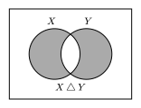

集合の対称差について解説します。

<!--more-->

## 前提知識

- [和集合]()
- [共通部分]()
- [差集合]()

## 定義

{}
$X, Y$を集合とする。$X$か$Y$に属するが、両方には属さない元の集合を$X$と$Y$の**対称差**といい、$X \triangle Y$とかく。つまり、
$$X \triangle Y := (X \cup Y) \setminus (X \cap Y)$$

{}

## 注意

- $X \triangle Y = (X \setminus Y) \cup (Y \setminus X)$である。こちらを定義とすることもある。
- De Morganの法則より、$X^c \triangle Y^c = X \triangle Y$が成り立つ。
- 対称差は排他的論理和 (exclusive or; xor)という論理演算と対応している。
- Venn図にすると以下のようになる。  
  

## 参考文献
